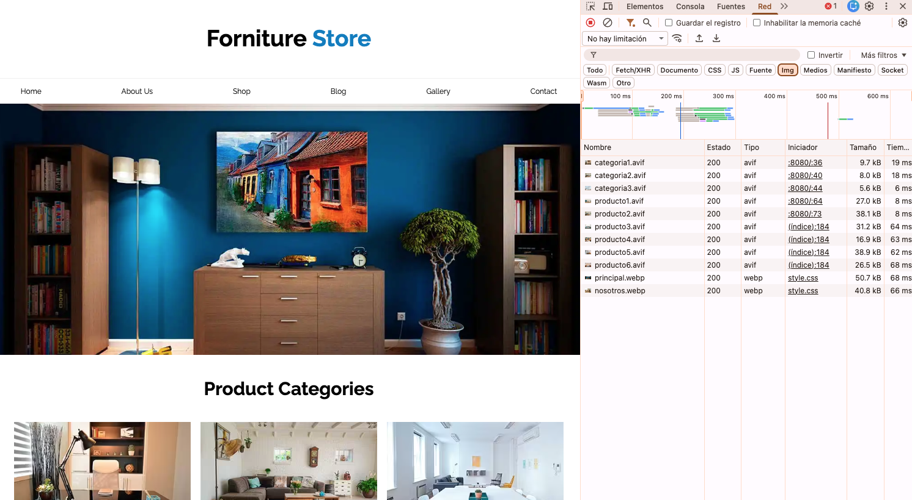

# Automatic Image Converter | WEBP - AVIF - Web Development
## Description
This Node code allows you to convert images from source folders to their webp and avif formats in real time. Simply drag or paste the original images into the source folder src/img or src/gallery, and their webp and avif versions will automatically be available in the corresponding build paths, for example build/img or build/gallery.

It is recommended to use the HTML tag to increase browser coverage
```

```

## Installation:
```
cd Automatic_Image_Converter_webp_avif
npm install
gulp
```

## Usage
only add images jpg,png,jpeg to a src/img or src/gallery and in your HTML call the images from the folder build/img or build/gallery

## Technologies
- Node / HTML / CSS

## Screenshot
